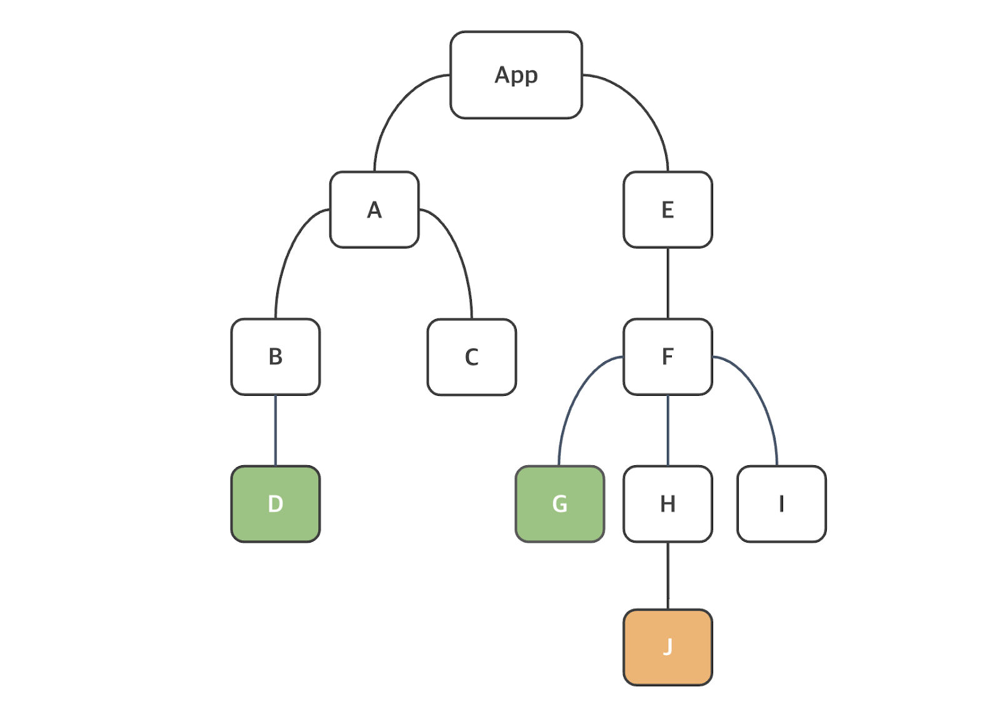

## React Hook 
Hook 개념은 React version 16.8부터 도입되었는데 이것을 이용하면 함수 컴포넌트에서 상태와 리액트의 다른 기능을 이용 가능(예전에는 class 컴포넌트 방식으로만 가능)

이것이 Hook라는것을 명시하기 위한 규칙들

1. 리액트 함수 컴포넌트의 최상위 수준에서 Hook을 호출
2. 반복문, 조건문, 중첩 함수 내에서 Hook를 호출 불가
3. Hook는 함수이기에 동사로 시작하는데 use로 시작하고 그 뒤 훅을 사용하는 목적 따라옴

### useState
1. Counter라는 컴포넌트 생성
2. App.jsx의 return 부분을 비우고 Counter 컴포넌트만 삽입
3. Counter 컴포넌트의 return문은 
```jsx
return (<div></div>);
```
로 고정

```jsx
import { useState } from "react";

function Counter() {
  // 초기값이 0인 상태 선언
  const [ count, setCount ] = useState(0);

  return (
  <div>
    <p>버튼 클릭 횟수 = {count} </p>
    <button onClick={() => setCount(count + 1)}>
      증가 {count}
    </button>
  </div>
  );
}

export default Counter
```

#### 참고 사항
html 태그 내의 onclick은 소문자지만 React 상의 이벤트 이름은 카멜 케이스로 작성되어야함 -> onClick

함수는 이벤트 핸들어에 전달되어야하며 사용자가 버튼을 클릭할때만 함수를 호출. 이상의 경우 화살표 함수를 사용하는데 이는 코드를 더 압축적으로 사용할 수 있으며 그에 따라 코드 가독성이 개선. 그런데 이벤트 핸들러 안에서 함수를 호출하면 컴포넌트가 렌더링될 때 함수가 호출되어 무한 루프 발생 가능성 존재

```jsx
// 함수가 버튼을 눌렀을 때 호출되는 예시
<button onClick={() => setCount(count+1)}> 증가 {count} </button>

// 함수가 렌더링 중에 호출되는 예시 -> 무한루프 가능성 존재
<button onClick={setCount(count+1)}> 증가 {count} </button>
```

```jsx
const count = 0;
console.log(count); // 결과값이 0
const count = setCount(count+1)   // 1이라는 값이 count 상수에 대입
console.log(count); // 결과값이 1
```

### 일괄처리(Batching)
React 상에서는 상태 업데이트에서 일괄처리를 이용해 리렌더링 감소. React 18 이전에는 일괄 처리가 버튼 클릭과 같은 브라우저 이벤트 중에 업데이트 되는 상태에서만 가능

1. MyComponent3 생성
2. App에 MyComponent3 컴포넌트를 삽입해 main -> App -> MyComponent3로 이어지는 TreeStructure 구현 후 npm run dev로 빈 화면 출력
3. count / count2 라는 상태(state) 선언하고 각 값을 0으로 초기화
4. retrun문
```jsx
return (
  <>
    <p> 현재 값 : {count} | {count2} </p>
    <button onClick={}> 증가 </button>
  </>
)
```

#### 구현식
```jsx
import { useState } from "react";

function MyComponent3() {
  const [count1, setCount1] = useState(0);
  const [count2, setCount2] = useState(0);

  const increment = () => {
    setCount1(count1 + 1);    // 먼저 호출되니 상태가 바뀔때마다 리렌더링이 일어나야하는데
    setCount2(count2 + 1);    // 이것도 호출되고 나서 렌더링은 하나만 발생
  }

  return (
  <>
    <p> 현재 값 : {count1} | {count2} </p>
    <button onClick={increment}> 증가 </button>
  </>
)
}

export default MyComponent3
```

여태까지 정리를 바탕으로 Counter 컴포넌트에 이하와 같은 increment를 정의하면 버튼을 한 번 누르면 1이 아닌 5씩 증가. 일괄처리를 한다고 본다면 값이 +1이 5번씩이 아닌 +5가 한번에 발생

그러나 +1이 한번만 적용되는 결과가 발생했었기에 주목

상태 업데이트는 일괄처리의 개념과 함꼐 비동기적으로 발생하는 점에 주목

이유는 상태 업데이트 이전에 그 다음 함수가 호출되서 count = 0인 상태에서 +1 하기 전 그 다음 setCount()가 호출되서 여전히 count의 값이 0에서 +1한 값이 나오는게 아니라 그 값이 업데이트 되기 이전 함수가 호출되는게 반복되었기에 버튼 한번으로 +1이 5번 호출되서 1이 출력
```jsx
import { useState } from "react";

function Counter() {
  // 초기값이 0인 상태 선언
  const [ count, setCount ] = useState(0);

const increment = () => {
  setCount(count +1);
  setCount(count +1);
  setCount(count +1);
  setCount(count +1);
  setCount(count +1);
}

  return (
  <div>
    <p>버튼 클릭 횟수 = {count} </p>
    <button onClick={increment}>
      증가 {count}
    </button>
  </div>
  );
}

export default Counter
```
이상의 문제를 해결하기 위해선 상태 값을 명확히 조회하고 다음 조회한 값에서 +1 실행

```jsx
const increment = () => {
  setCount(preCount => preCount +1);
  setCount(preCount => preCount +1);
  setCount(preCount => preCount +1);
  setCount(preCount => preCount +1);
  setCount(preCount => preCount +1);
}
```
이상처럼 매개변수를 추가해주게 된다면 무조건 (최신화된) const 값을 조회해야하기에  +5가 이루어진다고 담보 가능

vite project를 생성했을 때의 default onClick 형태로 함수가 작성

### useEffect
- useEffect는 React 함수 컴포넌트에서 보조작업을 수행하는데 이용가능. 그리고 대부분의 경우 fetch 요청
- 형식:
```jsx
useEffect(callback, [dependencies]);
```
callback 함수는 보조 작업 로직이 포함되어 있다(즉 argument가 함수이이게 arrow function의 작성 요령이 필수적). 그리고 두 번째 `[dependecies]`는 의존성을 포함하는 배열로 선택 사항에 해당. 그런데 `[]`로 작성하는 경우들이 존재

1. Counter2 Component를 생성
2. App Component내에 Counter2 삽입
3. return 구조
```jsx
return (
  <>
    <p>Counter : {count}</p>
    <button onClick = {() => setCount(preCount => preCount +1)}> 증가 </button>
  </>
)
```
4. count를 상태로 선언하고 초기값 0

```jsx
import { useEffect, useState } from "react";
function Counter2() {
  const [ count, setCount ] = useState(0);

  useEffect(() => {console.log('Hello! Changed the state, count!')}, []);

  return (
  <>
    <p>Counter2 : {count}</p>
    <button onClick = {() => setCount(preCount => preCount +1)}> 증가 </button>
  </>
)
}

export default Counter2
```
이상의 컴포넌트가 App에 포함되면 useEffect의 두 번째 argument의 `[]` 유무 혹은 element의 유무에 따라 콘솔창에 str이 출력되는 횟수 및 방식이 바뀐다는 것을 확인 가능
- 이상에서 알 수 있는 점
  1. `[]`는 optional(=method overloading의 개념이 jsx에도 존재)
  2. `[]`를 빈 배열로 두면 한번만 콘솔창에 값이 출력(strictMode는 두 번)
  3. `[count]`는 `[]`가 없는 것처럼 버튼을 누를때 마다 콘솔에 str 출력

Component가 함수형으로 구성되어 렌더링이 일어날때마다 App 컴포넌트는 Counter2 컴포넌트를 호출. 마찬가지로 Counter2는 useEffect() 함수를 호출. 그러면 호출될때마다 콘솔에 str이 찍혀야하는데 2번 상태에선 호출되지 않은것이 문제 발생

정리하자면 Counter2가 호출되었을 때 useEffect는 호출. 단, 두 번째 argument에 따라서 첫 번째 argument인 callback function이 선택적 호출

그러면 1, 3에서는 게속 찍혀나오는데 근본적인 해석이 차이 발생
- `[]`가 없는 경우 : 렌데링이 일어날때마다 callback function을 호출(count가 바뀌면 callback 호출)
- `[count]`로 작성하는 경우 : count값이 바뀔때마다 callback function호출
- `[]`로 작성하는 경우 : 첫 렌더링시마다

useEffect() 훅에는 콜백 함수가 모든 렌더링에서 실행되지 않게하는데 이용할 수 있는 두 번째 optional argument인 배열이 존재. count값 혹은 count2를 통해서 통제. 즉 `[count]`라면 count 값의 변화(=상태의 변화)가 있을때마다 useEffect의 callback 함수가 호출되게 정의

그리고 `[]`라면 useEffect()의 callback 함수는 첫 렌더링 이후에만 실행

이하에서는 useEffect()가 모든 보조작업(callback 함수) 이전에 실행되는 정리 함수를 return하는 것이 가능. 이 매커니즘으로 다음 번 보조작업을 실행하기 전 렌더링에서 각 효과를 정리 가능. 보통은 구독, 타이머 등 예기치 않은 작동을 방지하기 위해 정리하는 리소스 설정시 유용. 정리 기능은 페이지에서 컴포넌트 자체를 제거(또는 mount 해제) 후에도 실행

```jsx
import { useEffect, useState } from "react";

function Counter3() {
  const [count, setCount] = useState(0);
  useEffect(() => {
    console.log('Hello from useEffect!');
    return () => {
      console.log('clean up function 정리 함수');
    }
  }, [count])

  return (
    <>
      <p>Counter3 : {count}</p>
      <button onClick = {() => setCount(preCount => preCount +1)}> 증가 </button>
    </>
  );
}

export default Counter3
```
이러한 상태로 실행했을 경우 최초 렌더링시에 strictMode로 인해 Hello from useEffect - clean up function - Hello from useEffect가 실행되는게 확인 가능

그 이후 버튼을 누를때 마다 정리함수가 먼저 호출되고 그 다음 다시 hello from useEffect가 출력된다는걸 확인하면 값 변경 -> 정리함수 호출 -> 컴포넌트 재렌더링 하는 시간적 순서가 존재

### useRef
- 해당 훅은 DOM 노드에 접근에 이ㅛㅇ할 수 있는 변경 가능한 ref 객체를 return
- 형식 :
```jsx
const ref = useRef(initialValue)
```
useRef()의 return 값은 ref에는 argument로 초기화된 속성이 존재(이상에는 initalValue). 이상의 얘제에서는 inputRef 객체를 생성해 null로 초기화했고 JSX 요소의 ref 객체를 전달. `<input ref={inputRef} />` 부분에 해당하고 버튼을 클릭하면 버튼이 활성화되는게 아닌 input 창이 활성화 된 것. JavaScript의 getElementById() 등을 통해 HTML 요소를 불러온것처럼 useRef(null)인 상태에서 ref={inputRef}를 통해 앞으로 input창을 참조라라고 재대입한 것

이제 input 요소가 button 요소 내 callback 함수에 포함되고 current 속성을 이용해 input 요소의 focus 함수를 호출이 가능(`<button onClick={() => inputRef.current.focus()}>`에 해당)

그래서 버튼을 누를때 버튼이 활성화되는게 아니라 input요소가 활성화

### Custom Hook
React에서는 사용자 정의 Hook 함수를 정의 할 수 있다. 원칙에서 나온 것처럼 use로 시작해야하고 기본적으로는 JavaScript 함수. 마찬가지로 Custom Hook 내에서 다른 Hook를 호출하는것도 가능. 이것을 스면 컴포넌트 내에서의 코드의 복잡성 감소 가능

1. useTitle.js 생성
2. Counter4.jsx 생성
3. code 확인

```jsx
import { useState } from "react"
import useTitle from "./useTitle";

function Counter4() {

  const [ count, setCount ] = useState(0);
  useTitle(`당신은 ${count}번 클릭했습니다!`);

  return(
    <>
      <p>Counter : {count}</p>
      <br />
      <br />
      <button onClick={() => setCount(prevCount => prevCount + 1)}>++</button>
    </>
  )
}

export default Counter4
```

## Context API

1. 새 vite-project 생성
2. 프로젝트 명은 mycontextapi / framework는 React / language는 JavaScript로
3. github에 push
  - 주의 사항 : 잘 못 push하면 myapp은 없고 mycontextapi만 업로드
4. default screen 출력
5. title을 ContextAPI 학습 으로 수정


컴포넌트 Tree Structure가 깊고 복잡하면 props로 데이터 전달이 번거로울 수 있는데 컴포넌트 트리의 모든 컴포넌트를 통해 데이터를 전달해야하기 때문


로 보이듯 `상위 컴포넌트` -> `하위 컴포넌트`로의 일방향으로만 데이터 이동이 가능한 React 자체의 특성상 중간 단계의 컴포넌트들은 자신이 사용하지 않을 데이터를 전달 용도로 받아오고 또 자신의 하위 컴포넌트로 이동시켜야하는 문제점 발생

이상의 문제를 해결하기 위해 Context API의 도입으로 테마나 인증된 사용자 등 컴포넌트 트리의 여러 컴포넌트에 필요할 수 있는 전역 데이터를 보관하는 컨테이너 역할


위 그림처럼 Context에 저장되어있는 전역 데이터들은 컴포넌트의 위계에 무관하게 필요하에 컨테이너 내에 있는 데이터를 참조하거나 편집 가능

이를 사용하기 위한 코드의 예시

1. Context는 기본값을 설정하기 위해 argument를 받는 createContext() 메서드로 생성. 컨텍스트에 대한 파일을 직접 만들 수 있다
```js
import React from "react";

const AuthContext = React.createContext('');

export default AuthContext;
```

2. AuthContext.Provider 컴포넌트를 이용해 다른 컴포넌트에서 전역 데이터들을 이용할 수 있게. 중요한 점은 어느 범위에 있는 컴포넌트들이 이 전역 데이터에 접근할 수 있는가를 설정 할 수 있다는 점

먼저 일반적인 손자 하위 컴포넌트에 username을 전달하는 과정
```jsx
//App.jsx
import MyComponent from './MyComponent'
import './App.css'

function App() {

  const username = '김일';

  return (
    <>
      <MyComponent username={username}/>
    </>
  )
}

export default App


//MyComponent.jsx
import Hello from "./Hello";

function MyComponent(props) {

  return(
    <>
      <Hello username={props.username}/>
    </>
  );
}

export default MyComponent


//Hello.jsx
function Hello(props) {
  return(
    <>
      안녕하세요, {props.username}
    </>
  );
}

export default Hello
```
이러한 코드 형태가 일반적인 props의 전달 과정

ContextAPI를 적용한 형태는 현재 mycontextapi 프로젝트에 작성되어있고 대체품으로 Recoil 사용 가능

## 리액트 목록 처리
.map() : 기존 배열의 각 element들에게 callback 함수를 호출한 결과를 포함하는 새 배열을 만든다
```js
const arr = [1,2,3,4];
const newArr = arr.map(() => {x*2});
console.log(newArr);    // 결과값 : [2,4,6,8]
```

#### MyList.jsx
```jsx
import React from "react";
import AuthContext from "./AuthContext";

function MyList() {
  const username = React.useContext(AuthContext);
  const data = [1,2,3,4,5,6,7,8,9,10]

  return(
    <>
      <ul>
        {
          data.map((element, index) => 
          <li key={index}>List Item : {element}</li>
          )
        }
      </ul>

      <p>안녕히 가세요, {username}</p>
    </>
  )
}

export default MyList
```
이상은 컴포넌트의 정수 배열을 ul list의 자식 태그에 해당하는 `<li>` 태그로 각각의 element들을 불러온 코드
React list 항목에는 row가 추가, 업데이트, 삭제되었는지 감지하느데 이용하는 고유 키(unique key)가 필수적으로 요구(Js 자체에서는 x). 그래서 .map() 메서드의 두 번째 argument로 index를 사용해 경고 처리

* 참조 : 목록 순서를 바꾸거나 항목을 추가 또는 삭제하는 경우 index 값이 멋대로 바뀔 수 있기에 실제로는 index를 통해 key 설정을 권장하지 않고 데이터의 unique key를 별개로 설정해 집어넣는 것이 적절

* 그러나 매번 별개로 만들기는 힘들어 uuid 같은 고유 id를 생성하는 라이브러리 존재

#### MyTable.jsx
```jsx
function MyTable() {
  const data = [
    {id: 1, brand: '기아', model: '셀토스'},
    {id: 2, brand: '현대', model: '그랜저'},
    {id: 3, brand: '아우디', model: 'A8'}
  ];

  return(
    <>
      <table>
        <tbody>
          {
            data.map((item) => 
              <tr key={item.id}>
                <td>{item.brand} : </td>
                <td>{item.model}</td>
              </tr>
            )
          }
        </tbody>
      </table>
    </>
  )
}

export default MyTable
```
데이터가 객체의 배열이라면 테이플 형식으로 표기하는게 용이히다. 사전 data에 id 값을 연결해 tr 태그에 고유값인 key 속성을 넣어고 이는 향후 DB와의 연결을 고려한 코딩

### 리액트 이벤트 처리
리액트의 이벤트 처리는 DOM 요소 이벤트 처리와 유사. HTML 이벤트 처리와의 다른 점은 이벤트를 지정할 때 카멜 케이스 사용(onclick =/ onClick)

```jsx
function MyComponent2() {
  // 버튼을 누르면 호출되는 함수 정의
  const handleClick = () => {
    alert ('Button pressed!');
  }

  return (
    <>
      <button onClick={handleClick()}>Press Me!</button>
    </>
  )
}

export default MyComponent2
```

함수를 직접 호출하는 것 대신에 함수 이름을 이벤트 핸들러(onClick)에 전달해야 한다. 이제 handleClick 함수는 return문 외부에 정의되어 함수 이름을 이용해 함수 참조가 가능

html / css / js로 회원가입 구현시 form을 사용했었는데 폼이 제출되면 default 형태로 새창이 열린다. 그런데 SPA는 새창으로 넘기는 일 없이 그대로 갱신이 되야하기에 새 창이 뜨는걸 막는 메서드가 추가적으로 존재하느데 이것이 preventDefault()

#### MyForm.jsx
```jsx
function MyForm() {
  // Form이 제출될 때 호출되게 작성
  const handleSubmit = (event) => {
    event.preventDefault();   // md 파일에서 작성한 기본 동작 방지 메서드
    // onSubmit에 딸려있는 default는 양식 제출 -> DB나 백엔드로
    alert('제출 시에 나오는 경고창입니다')
  }
  return(
    <>
      <form onSubmit={handleSubmit}>
        <input type="submit" value="Submit!"/>
      </form>
    </>
  )
}

export default MyForm
```

이상의 이벤트 핸들러에서 onClick / onSubmit에 관련된 부분 학습했고 중요한 점은 각 태그를 카멜 케이스로 작성 함수를 callback으로 호출하거나 혹은 컴포넌트 내에 변수 형태로 함수를 정의하고 함수의 이름만 사용해 결과값이 아니라 함수 자체를 참조할 수 있게끔 작성

이상의 경우에서 공통적으로 handle+이벤트명을 사용

오래된 자료를 보게 될 경우 clickHandler라는 표현을 쓰기도 하지만 최근은 대부분 handle + 이벤트명으로 바뀌는 추세

## 리액트 폼 처리