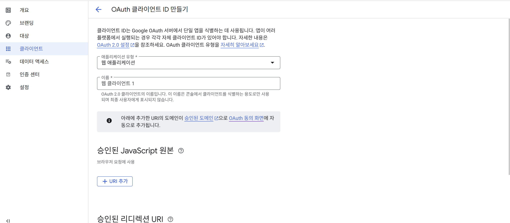

# OAuth2란
- OAuthd는 제 3자에게 계정 관리를 맡기는 방식으로 구글 / 네이버 / 카카오 등의 로그인 방식

용어 정리
- Resource Owner : 인증 서버에 자신의 정보를 사용하게 허가하는 주체
- Resource Server : 리소스 오너의 정보를 가지며 리소스 오너의 정보를 보호하는 주체 
- Client Application : 인증 서버에게 인증을 받고 리소스 오너의 리소스를 사용하는 주체

 OAuth를 사용하기 위해선 인증 서버에서 발급받은 토큰을 사용해 리소스 서버에 리소스 오너의 정보를 요청하고 응답받아 사용

 ## Resource Owner의 정보를 취득하는 방법
 1. 권한 부여 승인 타입(Authorization code grant type) : OAuth2에서 가장 보편적인 인증 방안. 클라이언트가 리소스에 접근하는데 사용, 권한에 접근할 수 있는 코드와 리소스 오너에 대한 액세스 토큰을 발급받는 방식
2. 암시적 승인 타입(Implict grant type) : 서버가 없는 JS 웹 애플리케이션 클라이언트에서 주로 사용하는 방법으로 클라이언트가 요청을 보내면 리소스 오너의 인증 과정 외에는 권한 코드 교환 등 별다른 인증 없이 액세스 토큰 제공
3. 리소스 소유자 암호 자격증명 방식(Resource Owner password credentials) : 클라이언트의 패스워드를 이용해 액세스 토큰에 대한 사용자의 자격 증명 교환 방식
4. 클라이언트 자격증명 승인 타입(Client credentials grant) : 클라이언트가 컨텍스트 외부에서 액세스 토큰을 얻어 특정 리소스에 접근 허용할때 사용하는 방식

권하 부여 코드 승인 타입 중심으로 설명할 때는 사용자 데이터가 외부로 전송되지 않아 안전하고 OAuth에서 가장 잘 알려진 방식

- 권한 요청 : 클라이언트가 특정 사용자 데이터에 접근하기 위한 권한 서버, 즉 구글 및 카카오 등의 권한 서버에 요청을 보내는 것을 의미. 요청 URL은 권한 서버마다 차이가 있지만 보통은 클라이언트 ID / Redirect URL / 응답 타입 등을 파라미터로 보낸다
- 권한 요청을 위한 파라미터 예시
```
GET spring-authorization-server.exmaple/authorize?
  client_id=YOUR_GOOGLE_TOKEN
  redirect_uri=http://localhot:5173/
  response_type=code&
  scope=profile
```
client_id : 인증 서버가 클라이언트에 할당한 고유 식별자
redriect_uri : 로그인 성공 시 이동하는 URI 주소
response_type : 클라이언트가 제공 받길 원하는 응답 타입. 인증 코드를 받을 때는 code 값 포함
scope : 제공받고자 하는 리소스 오너의 정보 목록

액세스 토큰을 받게 되는데 이를 API 응답 / return. 그래서 액세스 토큰을 통해 리소스 오너의 정보를 가져오면 리소스 서버는 토큰이 유효한지 검사한 뒤 응답

그래서 Google 로그인 추가를 위해 인증 서버에서 토큰 발급 필요

https://cloud.google.com/cloud-console




```java
spring.application.name=shoppinglist2

spring.datasource.url=jdbc:mariadb://localhost:3310/shoppinglist2db
spring.datasource.username=root
spring.datasource.password=1234
spring.datasource.driver-class-name=org.mariadb.jdbc.Driver

spring.jpa.generate-ddl=true
spring.jpa.hibernate.ddl-auto=create-drop
spring.jpa.show-sql=true

spring.data.rest.basePath=/api

springdoc.swagger-ui.enabled=true
springdoc.swagger-ui.path=/swagger-ui.html
springdoc.api-docs.path=/api-docs
// Google OAuth2 클라이언트 설정
spring.security.oauth2.client.registration.google.client-id=YOUR_GOOGLE_CLIENT_ID
spring.security.oauth2.client.registration.google.client-secret=YOUR_SECERET_KEY
spring.security.oauth2.client.registration.google.scope=openid, profile, email
// OAuth2 성공 후 redriect될 프론트엔드 URL
// 추후 이용
oauth2.success.redirect-url=http://localhost:5173/login/oauth2/redirect
```

# 프론트엔드 수정
back-front를 연결하는데 Fetch API를 쓰는 대신 axios를 설치(npm install axios)

프론트엔드 상에서 Google OAuth2 라이브러리를 직접 사용해 로그인 흐름 처리 가능. 프론트엔드가 직접 로그인 팝업을 띄우고 결과를 처리하게 하는 라이브러리(`@react-oauth/google`)

이상의 라이브러리를 사용시 Google 로그인 컴포넌트를 쉽게 추가 가능하고 로그인 성공시 Google로 받은 사용자 정보(혹은 ID 토큰)를 처리 가능

이사의 방식을 도입해도 백엔드와의 인증 연동이 필요한데 프론트엔드에서 Google 로그인이 성공하면 Google이 발급한 토큰을 백엔드로 보내서 검증하고 백엔드는 검증된 사용자에 대해 JWT 토큰을 발급해 프론트엔드로 전송. 프론트엔드는 이 최종 JWT를 이용해 백엔드 API를 호출(이 과정에서 axios 사용)

`npm install @react-oauth/google`


## 수정된 코드들
#### 백엔드
```java
// CustomOAuth2SuccessHandler
package com.shoppinglist.shoppinglist2.security;

import jakarta.servlet.ServletException;
import jakarta.servlet.http.HttpServletRequest;
import jakarta.servlet.http.HttpServletResponse;
import lombok.RequiredArgsConstructor;
import org.springframework.beans.factory.annotation.Value;
import org.springframework.security.core.Authentication;
import org.springframework.security.oauth2.core.user.OAuth2User;
import org.springframework.security.web.authentication.SimpleUrlAuthenticationSuccessHandler;
import org.springframework.stereotype.Component;
import org.springframework.web.util.UriComponents;
import org.springframework.web.util.UriComponentsBuilder;

import java.io.IOException;
import java.nio.charset.StandardCharsets;

@Component
@RequiredArgsConstructor
public class CustomOAuth2SuccessHandler extends SimpleUrlAuthenticationSuccessHandler {
    private final JwtService jwtService;

    // application.properties에서 설정한 리다이렉트 URL 주입
    @Value("${oauth2.success.redirect-url}")
    private String redirectUrl;

    @Override
    public void onAuthenticationSuccess(HttpServletRequest request, HttpServletResponse response, Authentication authentication) throws IOException, ServletException {
        // OAuth2 인증 성공 후 호출
        OAuth2User oAuthUser = (OAuth2User) authentication.getPrincipal();

        // User 식별 정보 추출(ex: email / sub)
        // Google 에서 email 도는 sub 사용 가능
        String username = oAuthUser.getAttribute("email");  // sub로 사용 가능
        if(username == null) {
            logger.warn("OAuth2에서 username을 추출 가능");
            username = "oauth2user_" + oAuthUser.getName();
        }

        // JWT 토큰 생성
        String token = jwtService.generateToken(username);

        // 프론트엔드롷 리다이렉트할 URL 생성(토큰을 쿼리 파라미터로 추가)
        String targetUrl = UriComponentsBuilder.fromUriString(redirectUrl)
                .queryParam("token", token)
                .build()
                .encode(StandardCharsets.UTF_8) // UTF-8 인코딩 추가
                .toUriString();
        // 기존의 세션 제거
        clearAuthenticationAttributes(request);

        // 생성된 URL로 리다이렉트
        getRedirectStrategy().sendRedirect(request, response, targetUrl);
    }
}


// AuthEntryPoint
package com.shoppinglist.shoppinglist2.security;

import jakarta.servlet.ServletException;
import jakarta.servlet.http.HttpServletRequest;
import jakarta.servlet.http.HttpServletResponse;
import org.springframework.security.core.AuthenticationException;
import org.springframework.security.web.AuthenticationEntryPoint;
import org.springframework.stereotype.Component;

import java.io.IOException;

@Component
public class AuthEntryPoint implements AuthenticationEntryPoint {
    // 인증되지 않은 사용자가 보호된 리소스에 접근할 때 호출
    @Override
    public void commence(HttpServletRequest request, HttpServletResponse response, AuthenticationException authException) throws IOException, ServletException {
        // 401 응답하기 위해서 커스텀
        response.setStatus(HttpServletResponse.SC_UNAUTHORIZED);
        response.setContentType("application/json");
        response.getWriter().write("\"error\": \"Unauthorized - Please Log In\"}");
    }
}


// SecurityConfig
package com.shoppinglist.shoppinglist2.security;

import lombok.RequiredArgsConstructor;
import org.springframework.context.annotation.Bean;
import org.springframework.context.annotation.Configuration;
import org.springframework.http.HttpMethod;
import org.springframework.security.authentication.AuthenticationManager;
import org.springframework.security.config.Customizer;
import org.springframework.security.config.annotation.authentication.configuration.AuthenticationConfiguration;
import org.springframework.security.config.annotation.web.builders.HttpSecurity;
import org.springframework.security.config.annotation.web.configuration.EnableWebSecurity;
import org.springframework.security.config.annotation.web.configurers.AbstractHttpConfigurer;
import org.springframework.security.config.http.SessionCreationPolicy;
import org.springframework.security.crypto.bcrypt.BCryptPasswordEncoder;
import org.springframework.security.crypto.password.PasswordEncoder;
import org.springframework.security.web.SecurityFilterChain;
import org.springframework.security.web.authentication.UsernamePasswordAuthenticationFilter;
import org.springframework.web.cors.CorsConfiguration;
import org.springframework.web.cors.CorsConfigurationSource;
import org.springframework.web.cors.UrlBasedCorsConfigurationSource;

import java.util.Arrays;

import static org.springframework.security.config.Customizer.withDefaults;

@Configuration
@EnableWebSecurity
@RequiredArgsConstructor
public class SecurityConfig {

    private final UserDetailsServiceImpl userDetailsService;
    private final JwtService jwtService;
    private final AuthEntryPoint authEntryPoint;
    private final CustomOAuth2SuccessHandler customOAuth2SuccessHandler;

    @Bean
    public PasswordEncoder passwordEncoder() {
        return new BCryptPasswordEncoder();
    }

    @Bean
    public AuthenticationManager authenticationManager(AuthenticationConfiguration config) throws Exception {
        return config.getAuthenticationManager();
    }

    @Bean
    public JwtAuthenticationFilter authenticationFilter() {
        return new JwtAuthenticationFilter(jwtService, userDetailsService);
    }

    @Bean
    public SecurityFilterChain filterChain(HttpSecurity http) throws Exception {
        http.csrf(AbstractHttpConfigurer::disable)  // CSRF 보호 비활성화(Stateless JWT 사용)
                .cors(Customizer.withDefaults())    // CORS 설정(이하의 설정 사용)
                .sessionManagement(session ->
                        session.sessionCreationPolicy(SessionCreationPolicy.STATELESS))     // 세션 비활성화
                .authorizeHttpRequests(auth -> auth
                        // /login 엔드포인트의 POST 요청 모두 허용
                        .requestMatchers(HttpMethod.POST, "/login").permitAll()
                        .requestMatchers("/swagger-ui/index.html", "/swagger-ui/**", "/api-docs", "/api-docs/**").permitAll()
                        .requestMatchers("/oauth2/**", "/login/oauth2/code/*").permitAll()
                        .anyRequest().authenticated())
                .oauth2Login(oauth2 -> oauth2.successHandler(customOAuth2SuccessHandler))
                .exceptionHandling(ex -> ex
                        .authenticationEntryPoint(authEntryPoint))  // 인증 실패시 처라
                .addFilterBefore(authenticationFilter(), UsernamePasswordAuthenticationFilter.class);    // JWT 필터 추가

//                http.csrf(csrf -> csrf.disable())
//                .cors(withDefaults())
//                .authorizeHttpRequests(authorizeHttpRequests ->
//                        authorizeHttpRequests.anyRequest().permitAll());

        return http.build();
    }

    @Bean
    public CorsConfigurationSource corsConfigurationSource() {
        CorsConfiguration configuration  = new CorsConfiguration();
        configuration.setAllowedOrigins(Arrays.asList("http://localhost:5173", "http://localhost:5174"));	// FE 서버 주소
        configuration.setAllowedMethods(Arrays.asList("GET", "POST", "PUT", "DELETE", "PATCH"));
        configuration.setAllowedHeaders(Arrays.asList("*"));	// 모든 헤더 허용
        configuration.setAllowCredentials(true);
        UrlBasedCorsConfigurationSource source = new UrlBasedCorsConfigurationSource();
        source.registerCorsConfiguration("/**", configuration);
        return source;
    }
}


// LoginController
package com.shoppinglist.shoppinglist2.web;

import com.shoppinglist.shoppinglist2.security.JwtService;
import lombok.RequiredArgsConstructor;
import org.springframework.http.HttpHeaders;
import org.springframework.http.ResponseEntity;
import org.springframework.security.authentication.AuthenticationManager;
import org.springframework.security.authentication.UsernamePasswordAuthenticationToken;
import org.springframework.security.core.Authentication;
import org.springframework.web.bind.annotation.PostMapping;
import org.springframework.web.bind.annotation.RequestBody;
import org.springframework.web.bind.annotation.RestController;

@RestController
@RequiredArgsConstructor
public class LoginController {

    private final JwtService jwtService;
    private final AuthenticationManager authenticationManager;

    @PostMapping("/login")
    public ResponseEntity<?> login(@RequestBody AccountCredentials credentials) {
        // 자격 증명으로 인한 인증 토큰 생성
        UsernamePasswordAuthenticationToken creds =
                new UsernamePasswordAuthenticationToken(credentials.username(), credentials.password());

        // 사용자 인증
        Authentication auth = authenticationManager.authenticate(creds);

        // JWT 생성
        String jwt = jwtService.generateToken(auth.getName());

        // JWT를 'Authorization' 헤더에 담아서 응답
        return ResponseEntity.ok()
                .header(HttpHeaders.AUTHORIZATION, "Bearer " + jwt)
                .header(HttpHeaders.ACCESS_CONTROL_EXPOSE_HEADERS, "Authorization") // FE에서 헤더를 읽을 수 있게
                .build();
    }
}
```

#### 프론트엔드(미완성)
```jsx
// api
// shoppingapi
import axios, { AxiosRequestConfig } from 'axios';
import { AccountCredentials, ShoppingItem, ShoppingItemEntry } from '../../type';

const BASE_URL = `${import.meta.env.VITE_BASE_URL}`;

const apiClient = axios.create({
  baseURL: BASE_URL,
  headers: {
    'Content-Type': 'application/json'
  },
});

apiClient.interceptors.response.use(
  response => response,
  error => {
    console.log('API Error : ', error.response || error.message || error);
    return Promise.reject(error.response?.data || new Error(error.message || '예상 못한 에러 발생'));
  }
);

// JWT 토큰 포함 요청 설정
const getRequestConfig = () : AxiosRequestConfig => {
  const token = sessionStorage.getItem('jwt');
  if(token) {
    return {
      headers: { Authorization: token },  // `Bearer <token>` 형식 저정 토큰 사용
    };
  }
  return {};
}

// 기존 API 관련 함수 정의
export const login = async (creds : AccountCredentials): Promise<string> => {
  try {
    const response = await apiClient.post('/login', creds);
    console.log('=== Response Headers ===', response.headers);  // 여기에 찍어야 함
    const jwtToken = response.headers['authorization'];       // 소문자 key
    // const jwtToken = response.headers.authorization;
    console.log(jwtToken);
    if(!jwtToken) {
      throw new Error('JWT 토큰이 headers에 담겨있지 않습니다')
    }
    return jwtToken;
  } catch (error) {
    console.log('username / password가 틀렸습니다.')
    // error 객체가 AxiosError 인스턴스 유무 확인 과정
    if(axios.isAxiosError(error) && error.response) {
      throw new Error(error.response.data?.message || error.response.data?.error || `Login 실패 (${error.response.status})`);
    } else if (error instanceof Error) {
      throw error;
    } else {
      throw new Error('예측 불가능한 오류가 로그인상에서 발생')
    }
  }
};

export const getItems = async (): Promise<ShoppingItem[]> => {
  const response = await apiClient.get('/api/items', getRequestConfig());
  return response.data;
}

export const addItems = async (item: ShoppingItemEntry): Promise<ShoppingItem> => {
  const response = await apiClient.post('/api/items', item, getRequestConfig());
  return response.data;
}

export const updateItem = async (id: number, itemUpdate: ShoppingItemEntry): Promise<ShoppingItem> => {
  const response = await apiClient.put(`/api/items/$${id}`, itemUpdate, getRequestConfig());
  return response.data;
}

export const deleteItem = async (id: number) : Promise<void> => {
  await apiClient.delete(`/api/items/${id}`, getRequestConfig())
}

// Google ID 토큰 백엔드 전송 및 JWT 수신 관련 함수
/**
 * Google ID 토큰을 백엔드로 보내고 검증 후 앱의 JWT 받아오기
 * @param idToken - Google 로그인 성공시 받은 ID 토큰
 * @returns 백엔드에서 발급한 JWT(Authorization headers 값)
 */
export const authenticateWithGoogleToken = async (idToken : string): Promise<string> => {
  console.log('Google ID 토큰을 백엔드로 전송', idToken.substring(0, 30) + '...')   // 토큰 전체를 노출하지 않기 위해
  try {
    // 백엔드에 구현한 Google 토큰 검증 엔드포인트 호출
    const response = await apiClient.post('/api/auth/google', {idToken});
    const backendJwt = response.data.token;   // 백엔드에서 token field에 JWT를 담아서 반환
    if(!backendJwt) {
      throw new Error('백엔드에서 JWT를 보내지 않았습니다.');
    }
    console.log('JWT가 백엔드로 부터 전송 : ', backendJwt.substring(0, 15) + '...');
    return backendJwt;    // 'Bearer <token>' 형태로 return
  } catch (error) {
    console.log('Backend Google Auth Error : ' + error);
    if(axios.isAxiosError(error) && error.response) {
      throw new Error(error.response.data?.message || error.response.data?.error || `백엔드 구글 인증 실패 (${error.response.status})`);
    } else if (error instanceof Error) {
      throw error;
    } else {
      throw new Error('예측할 수 없는 에러가 구글 인증 시에 발생했습니다.')
    }
  }
}


// Components
// ShoppingitemList
import { useState } from "react"
import { useQuery, useMutation, useQueryClient } from "@tanstack/react-query"
import { AgGridReact } from "ag-grid-react"
import { GridApi, ColDef, GridReadyEvent } from "ag-grid-community"
import { Button, Snackbar, Alert, Box } from "@mui/material"
import { getItems, deleteItem } from "../api/shoppingapi"
import { ShoppingItem } from "../../type"
import AddItem from "../components/AddItem"
import EditItem from "../components/EditItem"

import 'ag-grid-community/styles/ag-theme-material.css'
import 'ag-grid-community/styles/ag-grid.css'

function ShoppingItemList() {
  const [gridApi, setGridApi] = useState<GridApi | null>(null);
  const [openSnackbar, setOpenSnackbar] = useState(false);
  const [snackbarMsg, setSnackbarMsg] = useState('');
  const [snackbarSeverity, setSnackbarSeverity] = useState<'success' | 'error'> ('success');

  const queryClient = useQueryClient();

  const{ data: items, isLoading, isError, error } = useQuery<ShoppingItem[], Error>({
    queryKey: ['items'],
    queryFn: getItems,
  })

  const { mutate: deleteMutate } = useMutation({
    mutationFn: deleteItem,
    onSuccess: () => {
      queryClient.invalidateQueries({queryKey: ['items']});
      setSnackbarMsg('해당 품목이 정상적으로 삭제되었습니다.');
      setSnackbarSeverity('success');
      setOpenSnackbar(true);
    },
    onError: (error) => {{
      console.log('삭제 에러 : ', error);
      const message = error?.message || '삭제 실패 에러';
      setSnackbarMsg(message);
      setSnackbarSeverity('error');
      setOpenSnackbar(true);
    }},
  });

  const columnDefs: ColDef<ShoppingItem>[] = [
    { field: 'product', sortable: true, filter: true, flex: 2 },
    { field: 'amount', sortable: true, filter: true, flex: 1 },
    { field: 'purchased', 
      sortable: true, 
      filter: true, 
      flex: 1,
      cellRenderer: (parmas: {value:boolean}) => parmas.value ? 'Yes' : 'No' 
    },
    {
      cellRenderer: (params: {data?: ShoppingItem}) => (
        params.data ? <EditItem itemdata={params.data} /> : null
      ),
    },
    {
      cellRenderer: (params: {data?: ShoppingItem}) => ( 
        params.data ?
        <Button
          size="small"
          color="error"
          onClick={() => {
            if(window.confirm(`${params.data?.product} 항목을 삭제하시겠습니까?`)) {
              deleteMutate(params.data.id);
            }
          }}
        >Delete
        </Button> : null
      ),
      width: 120,
    },
  ];

  const onGridReady = (params: GridReadyEvent) => {
    setGridApi(params.api);
  };

  if(isLoading) {
    return <span>Loading ... </span>
  }

  if(isError) {
    return <span>항목을 가져오는데 오류 발생 : {error.message}</span>
  }

  return(
    <>
      <Box sx={{ display : 'flex', justifyContent: 'flex-start', mb:2, mt:2}}>
        <AddItem />
      </Box>

      <Box className='ag-theme-material' style={{height: 500, width: '100%'}}>
        <AgGridReact 
          rowData={items}
          columnDefs={columnDefs}
          pagination={true}
          paginationPageSize={onGridReady}
          animateRows={true}
          domLayout="autoHeight"
        />
      </Box>

      <Snackbar
        open={openSnackbar}
        autoHideDuration={3000}
        onClose={() => setOpenSnackbar(false)}
        anchorOrigin={{ vertical: 'bottom', horizontal: 'center'}}
      >
        <Alert
          severity={snackbarSeverity}
          onClose={() => setOpenSnackbar(false)}
        >
          {snackbarMsg}
        </Alert>
      </Snackbar>
    </>
  )
}

export default ShoppingItemList


// Login
import { ChangeEvent, useState } from "react";
import { Button, TextField, Snackbar, Divider, Box, CircularProgress, Stack, Alert } from "@mui/material";
import { AccountCredentials } from "../../type";
import { login, authenticateWithGoogleToken } from "../api/shoppingapi";
import { CredentialResponse, GoogleLogin } from "@react-oauth/google";

type LoginProps = {
  loginSuccess: () => void;
}

function Login({loginSuccess}: LoginProps) {
  const [ user, setUser ] = useState<AccountCredentials>({ username: '', password: ''});
  const [ open, setOpen ] = useState(false);
  const [ errorMsg, setErrorMsg ] = useState('Login failed');
  const [ loading, setLoading ] = useState(false);

  const handleChange = (event: ChangeEvent<HTMLInputElement>) => {
    setUser({...user, [event.target.name]: event.target.value});
  };

  // 아이디/비밀번호 로그인
  const handleUsernamePasswordLogin = () => {
    setLoading(true); // 로딩 시작
    login(user)
      .then(authorizationHeader => {
      sessionStorage.setItem('jwt', authorizationHeader);
      loginSuccess();
    })
    .catch( err => {
      setErrorMsg(err.message || "예상하지 못한 로그인 관련 에러가 발생했습니다.");
      setOpen(true);
    })
    .finally(() => {
      setLoading(false);  // 로딩 종료
    })
  };

  // Google 로그인
  const handleGoogleLoginSuccess = async (credentialResponse : CredentialResponse) => {
    console.log('Google Login Success(Frontend 상황에서) : ', credentialResponse);
    if(credentialResponse.credential) {
      setLoading(true);
      try {
        // Google ID 토큰을 백엔드로 보내 JWT 받아오는 과정
        const backendJwt = await authenticateWithGoogleToken(credentialResponse.credential);
        sessionStorage.setItem('jwt', backendJwt);
        loginSuccess();
      }
      catch (error:any) {
        console.error('구글 로그인 중에 백엔드 부분 인증 실패', error);
        setErrorMsg(`구글 로그인은 성공했으나 백엔드에서 오류 발생했습니다. ${error?.message || '알 수 없는 에러'}`);
        setOpen(true);
      }
      finally {
        setLoading(false);
      }
    } else {
      console.error('응답 결과에서 Google Credential을 찾을 수 없습니다.');
      setErrorMsg('Google Login Failed : Credential Not Found');
      setOpen(true);
    }
  };

  // Google 로그인 실패 관련 callback
  const handleGoogleLoginError = () => {
    console.error('Google Login Failed (Frontend)');
    setErrorMsg('구글 로그인 자체가 실패해습니다. 다시 시도하거나 좀 있다 시도하세요.');
    setOpen(true);
  };

  const handleKeyPress = ( event : KeyboardEvent ) => {
    if( event.key === 'Enter' && !loading ) { // 로딩 중에는 엔터키로 로그인 못하게
      handleUsernamePasswordLogin();
    }
  };

  return(
    <>
      <Stack spacing={2} alignItems="center" mt={10}>
        <h2>Login</h2>
        <TextField 
          name="username"
          label="Username"
          onChange={handleChange}
          onKeyPress={handleKeyPress}
          disabled={loading}
          autoFocus
          sx={{width: '300px'}}
        />
        <TextField 
          type="password"
          name="password"
          label="Password"
          onChange={handleChange}
          onKeyPress={handleKeyPress}
          disabled={loading}
          sx={{width: '300px'}}
        />
        <Button
          variant="contained"
          color="primary"
          onClick={handleUsernamePasswordLogin}
          disabled={loading}
          sx={{width: '300px'}}
        >
          {loading ? <CircularProgress size={24} color="inherit" /> : "LOGIN WITH USERNAME"}
        </Button>

        <Divider sx={{width: '300px', my: 2}}>OR</Divider>

        {/* Google 로그인 버튼 부분 */}
        <Box sx={{width: '300px', display: 'flex', justifyContent: 'center', opacity: loading ? 0.5 : 1}}>
          {/** Loading 중일떄는 Google 버튼을 숨기거나 바활성화. 혹은 투명도 조절**/}
          {!loading && (
            <GoogleLogin 
              onSuccess={handleGoogleLoginSuccess}
              onError={handleGoogleLoginError}
              useOneTap={false}
              width={'300px'}
            />
          )}
          {loading && <CircularProgress size={24} />}
        </Box>
      </Stack>
      <Snackbar
        open={open}
        autoHideDuration={4000}
        onClose={(() => setOpen(false))}
        anchorOrigin={{vertical: 'bottom', horizontal: 'center'}}
      >
        <Alert severity="error" onClose={() => setOpen(false)}>{errorMsg}</Alert>

      </Snackbar>
    </>
  )
}

export default Login


// AddItem
import { Button, TextField, Dialog, DialogContent, DialogTitle } from "@mui/material";
import { useState } from "react";
import { Item } from "./App";

type AddItemProps = {
  addItem: (item: Item) => void;
}

function AddItem(props: AddItemProps) {
  const [ open, setOpen ] = useState(false);
  const [ item, setItem ] = useState<Item>({
    product: '',
    amount: '',
  });

  const handleOpen = () => {
    setOpen(true);
  }

  const handleClose = () => {
    setOpen(false);
  }

  // App.tsx의 addItem 함수를 호출하고 item 상태를 전달
  const addItem = () => {
    props.addItem(item);
    // TextField에 있는 내용을 지우고  Modal 저장
    setItem({product: '',  amount: ''});
    handleClose();
  }

  return(
    <>
      <br />
      <Button onClick={handleOpen} variant="outlined">
        Add Item
      </Button>
      <Dialog open={open} onClose={handleClose}>
        <DialogTitle>New Item</DialogTitle>
        <DialogContent>
          <TextField value={item.product} margin="dense"
            onChange={e => setItem({...item, product: e.target.value})}
            label="Product/제품명" fullWidth />
          <TextField value={item.amount} margin="dense"
            onChange={e => setItem({...item, amount: e.target.value})}
            label="Amount/수량" fullWidth />
        </DialogContent>
        <Button onClick={addItem}>
          Add / 저장
        </Button>
        <Button onClick={handleClose}>
          Cancel / 취소
        </Button>
      </Dialog>
    </>
  );
}

export default AddItem


// App
import { useState, useEffect } from "react";
import { BrowserRouter, Routes, Route, Navigate } from "react-router-dom";
import { AppBar, Toolbar, Typography, Button, Container, Box, CssBaseline } from "@mui/material";
import { QueryClient, QueryClientProvider } from "@tanstack/react-query";
import Login from "./components/Login";

import ShoppingItemList from "./components/ShoppingitemList";

const queryClient = new QueryClient();

function App() {
  const [ isAuthenticated, setIsAuthenticated ] = useState<boolean>(false);

  useEffect(() => {
    const checkAuth = () => {
      const token = sessionStorage.getItem('jwt');
      setIsAuthenticated(!!token);
    };
    checkAuth();  // 위에서 정의한걸 바로 호출
    window.addEventListener('storage', checkAuth);  // 다른 탭의 변경 감지
    return () => {
      window.removeEventListener('storage', checkAuth);
    }
  }, []);

  const handleLoginSuccess = () => {
    setIsAuthenticated(true);
  }

  const handleLogout = () => {
    sessionStorage.removeItem('jwt');
    setIsAuthenticated(false);
    queryClient.clear();
  }

  return (
    <QueryClientProvider client={queryClient}>
      <BrowserRouter>
        <CssBaseline />
        <Container maxWidth="lg">
          <AppBar position="static" sx={{mt:4}}>
            <Toolbar>
              <Typography variant="h6" component="div" sx={{flexGrow : 1}}>
                Shopping List | 쇼핑 리스트
              </Typography>
              {isAuthenticated && (
                <Button color="inherit" onClick={handleLogout}>
                  Logout
                </Button>
              )}
            </Toolbar>
          </AppBar>
          <Box>
            <Routes>
              <Route path="/" 
              element={isAuthenticated ? <ShoppingItemList /> : <Navigate to="/login" replace />} />
              <Route path="/login" 
                element={isAuthenticated ? <Navigate to="/" replace /> : <Login loginSuccess={handleLoginSuccess} />} />
              <Route path="*" 
                element={<Navigate to={isAuthenticated ? "/" : "/login"} replace />} />
            </Routes>
          </Box>
        </Container>
      </BrowserRouter>
    </QueryClientProvider>
  )
}

export default App


// main
import React from 'react'
import ReactDOM from 'react-dom/client'
import App from './App.tsx'
import { GoogleOAuthProvider } from '@react-oauth/google'

const googleClientId = `${import.meta.env.VITE_GOOGLE_CLIENT_ID}`;

if (!googleClientId) {
  console.warn('Google Client ID가 설정되지 않았습니다.');
}

ReactDOM.createRoot(document.getElementById('root')!).render(
  <React.StrictMode>
    <GoogleOAuthProvider clientId={googleClientId}>
      <App />
    </GoogleOAuthProvider>
  </React.StrictMode>,
)
```